# Data Preprocessing & Label Distribution Analysis

This directory contains the data cleaning scripts, preprocessing pipelines, and exploratory data analysis (EDA) for the dataset.

---

## 📊 Label Distribution Overview

Below are the distribution bar charts for all target labels in the dataset.

<b>Click to expand/collapse Distribution Charts (1 – 13)</b>

 

<table>
  <tr>
    <td align="center"><b>Label 01: Symptom A</b></td>
    <td align="center"><b>Label 02: Symptom B</b></td>
  </tr>
  <tr>
    <td>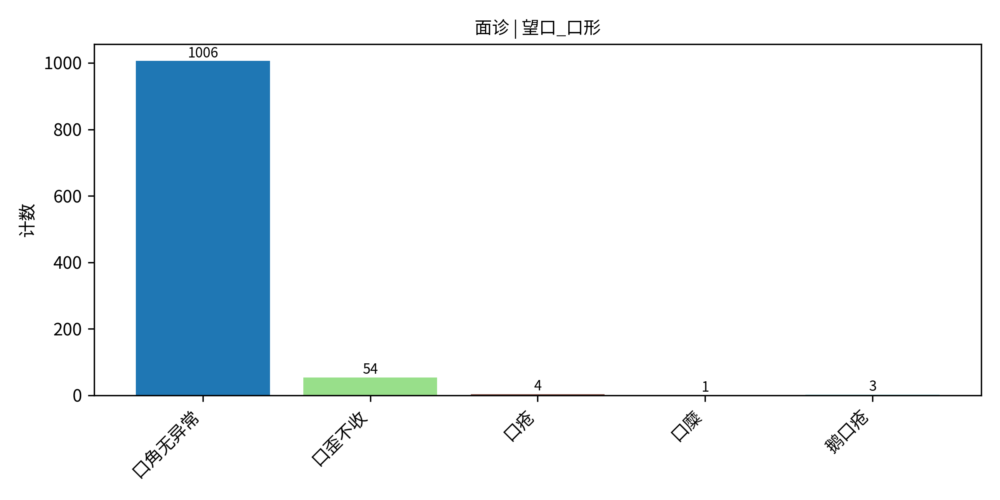</td>
    <td>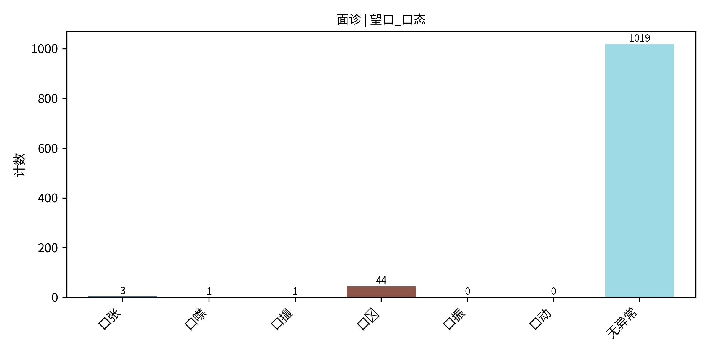</td>
  </tr>
  <tr>
    <td align="center"><b>Label 03: Symptom C</b></td>
    <td align="center"><b>Label 04: Symptom D</b></td>
  </tr>
  <tr>
    <td>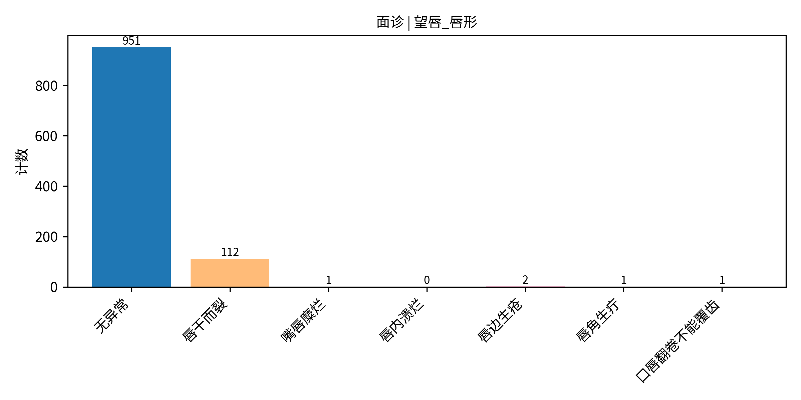</td>
    <td>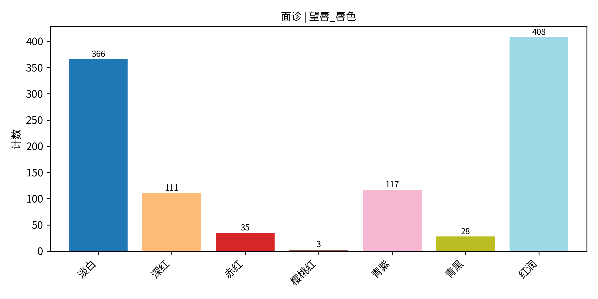</td>
  </tr>
  <tr>
    <td align="center"><b>Label 05: Symptom E</b></td>
    <td align="center"><b>Label 06: Symptom F</b></td>
  </tr>
  <tr>
    <td>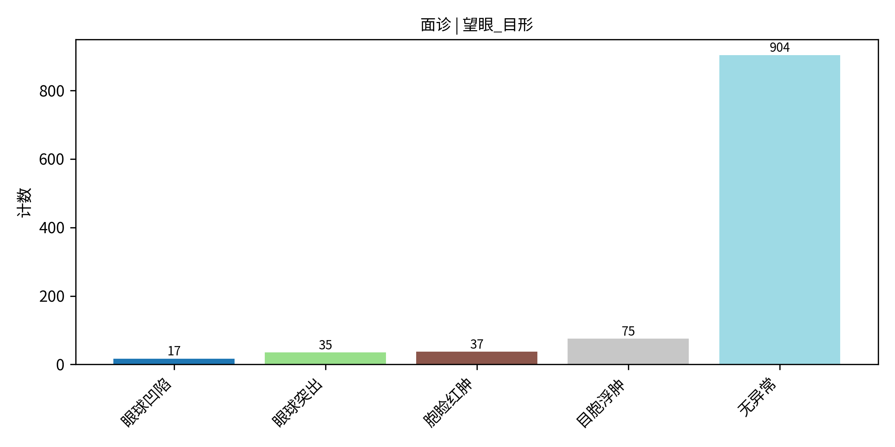</td>
    <td>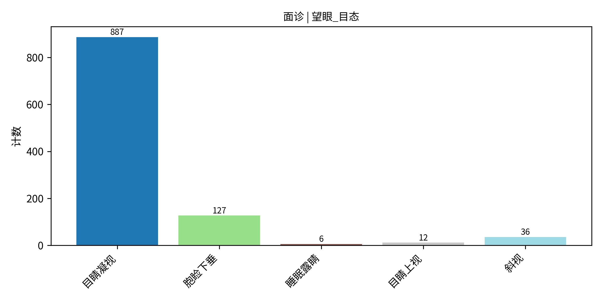</td>
  </tr>
   <tr>
    <td align="center"><b>Label 07: Symptom E</b></td>
    <td align="center"><b>Label 08: Symptom F</b></td>
  </tr>
  <tr>
    <td>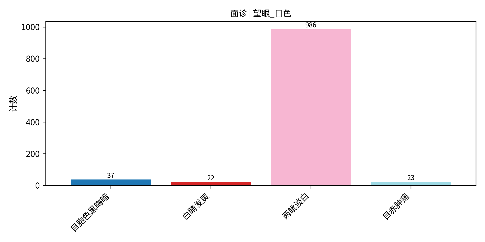</td>
    <td>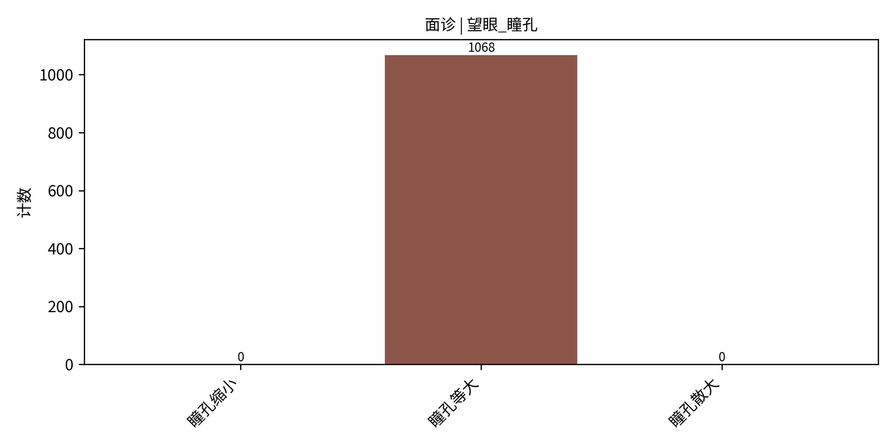</td>
  </tr>
   <tr>
    <td align="center"><b>Label 09: Symptom E</b></td>
    <td align="center"><b>Label 10: Symptom F</b></td>
  </tr>
  <tr>
    <td>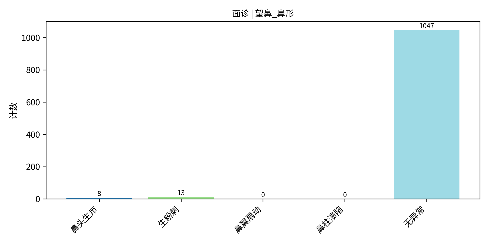</td>
    <td>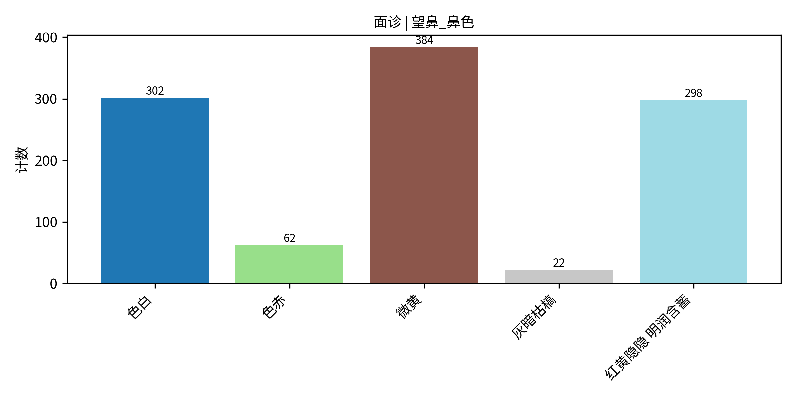</td>
  </tr>
   <tr>
    <td align="center"><b>Label 11: Symptom E</b></td>
    <td align="center"><b>Label 12: Symptom F</b></td>
  </tr>
  <tr>
    <td>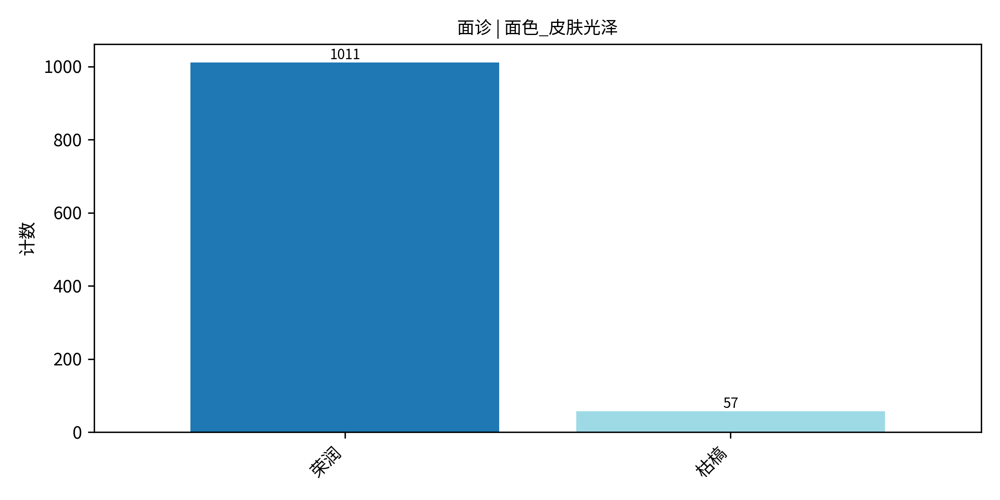</td>
    <td>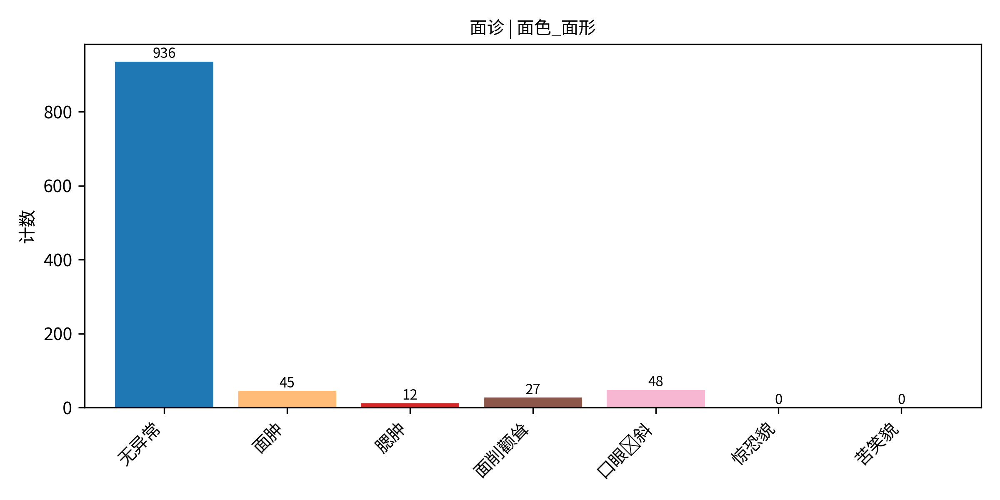</td>
  </tr>
   <tr>
    <td align="center"><b>Label 13: Symptom E</b></td>
  </tr>
  <tr>
    <td>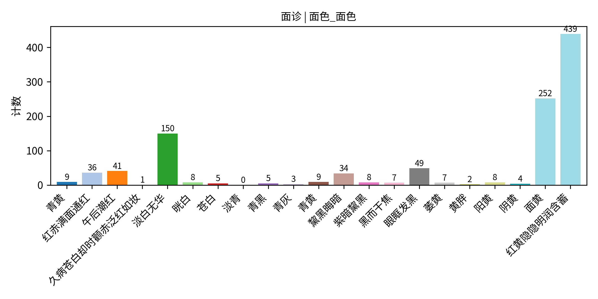</td>
  </tr>
</table>

<b>Click to expand/collapse Distribution Charts (14 – 19)</b>

 

<table>
  <tr>
    <td align="center"><b>Label 14: Feature X</b></td>
    <td align="center"><b>Label 15: Feature Y</b></td>
  </tr>
  <tr>
    <td>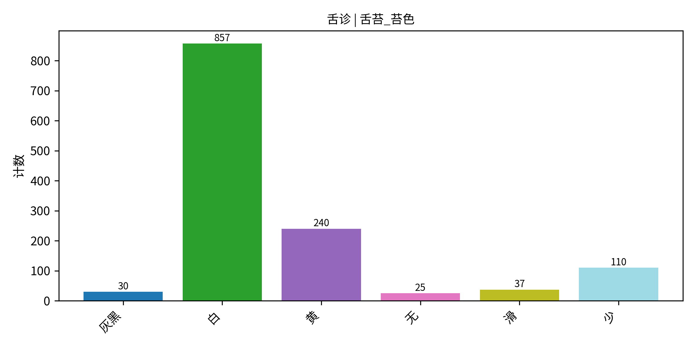</td>
    <td>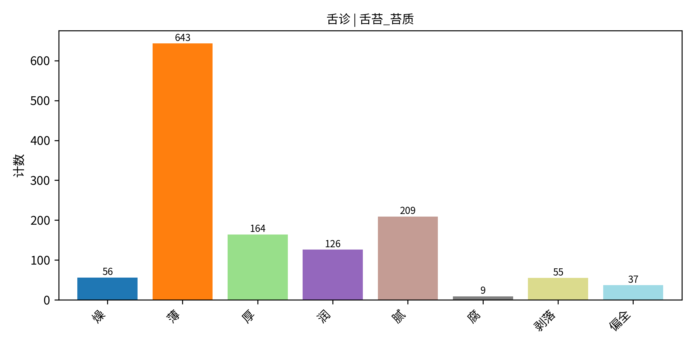</td>
  </tr>
  <tr>
    <td align="center"><b>Label 16: Feature X</b></td>
    <td align="center"><b>Label 17: Feature Y</b></td>
  </tr>
  <tr>
    <td>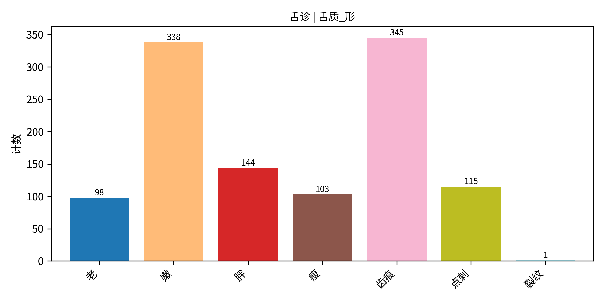</td>
    <td>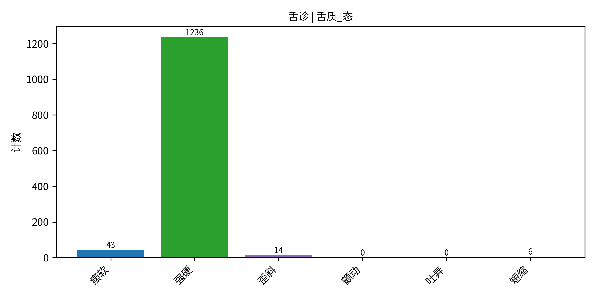</td>
  </tr>
  <tr>
    <td align="center"><b>Label 18: Feature X</b></td>
    <td align="center"><b>Label 19: Feature Y</b></td>
  </tr>
  <tr>
    <td>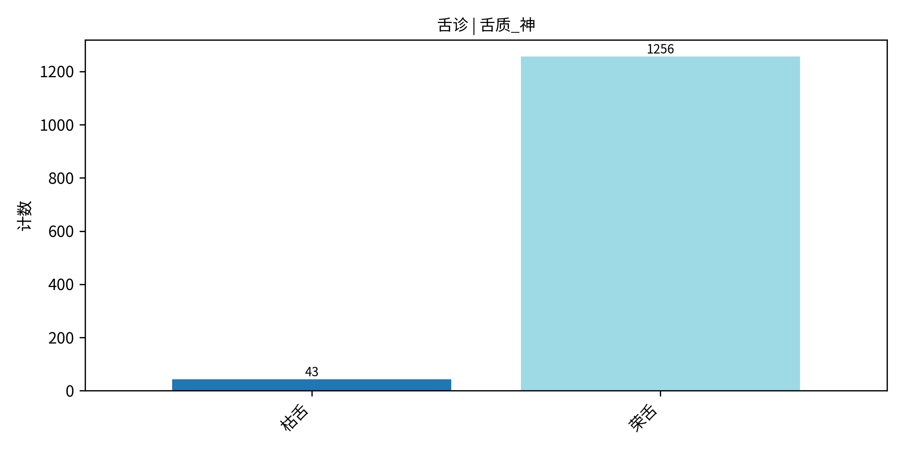</td>
    <td>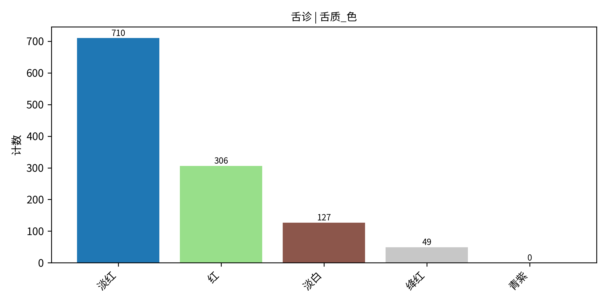</td>
  </tr>
  <!-- Add additional rows using the same <tr>/<td> structure -->
</table>

---

## 📈 Key Insights & Imbalance Strategy

* **Class Imbalance:** Highlight any heavily skewed labels here (e.g., Label 03 has an 80/20 skew).
* **Mitigation:** Mention techniques used (e.g., SMOTE, re-weighting loss functions, under-sampling).